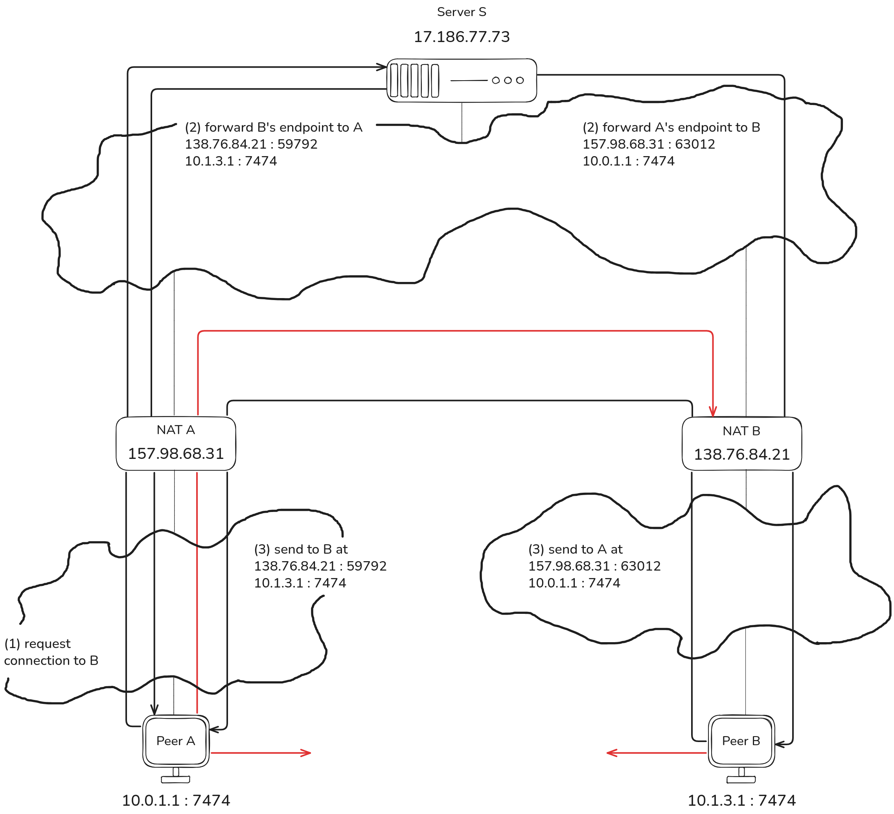

# P2P NAT Traversal Engine

A peer-to-peer Network Address Translation (NAT) traversal and connection-establishment engine

#

Devices behind home Wi-Fi or mobile networks often cannot connect directly to each other. This project helps two peers find and establish a direct connection, working around the obstacles that normally block them.

#

NAT traversal is a critically important issue in modern real-time internet communication, not a solved or trivial one. This project addresses it with Distributed Hash Table (DHT)-based peer discovery (no fixed server list, no manual IP exchange), an authenticated rendezvous protocol that coordinates the connection using HMAC, and UDP hole punching combined with TCP connect. It has been tested on real hardware - a local machine and a VPS - not just in theory. This is the connection-establishment layer: infrastructure for getting peers talking, not a full chat or file-sharing application.

#

- Event Poll-based single-threaded reactor (Edge-Triggered Notification mode)
- DHT-based peer discovery (Kademlia OpenDHT)
- Authenticated rendezvous protocol (HMAC-SHA256 with replay protection)
- UDP hole punching
- Outbound TCP connection establishment
- NAT keep-alive (periodic refresh so mappings don't expire)

#

* Adapted from Figure 5 in Ford, Srisuresh & Kegel (2005)
