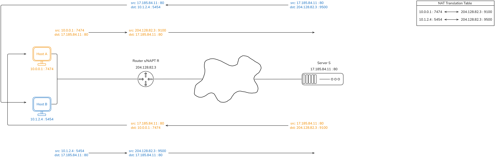
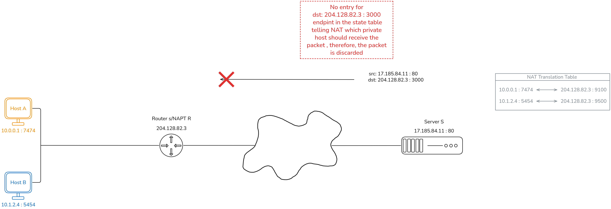
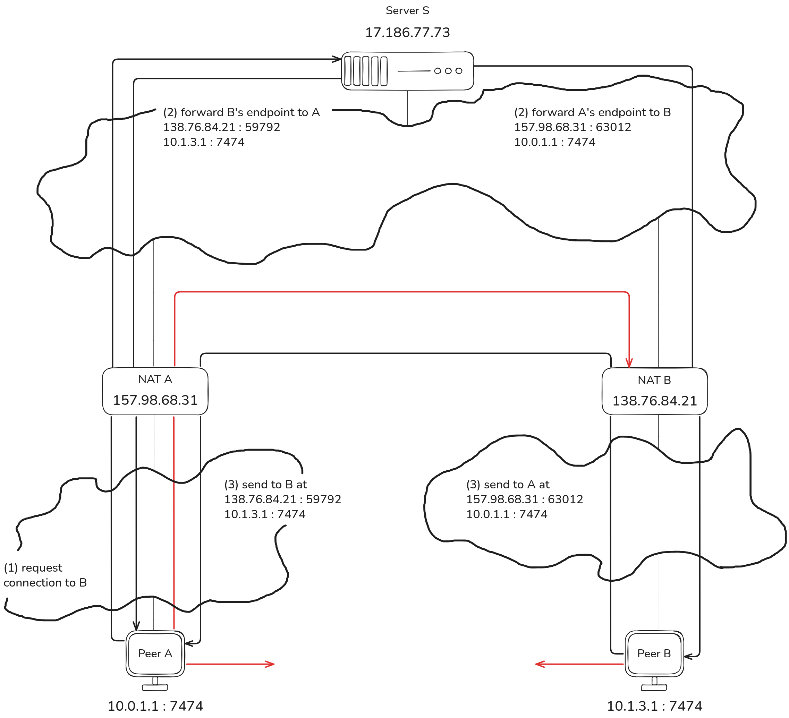

# P2P NAT Traversal Engine

A peer-to-peer Network Address Translation (NAT) traversal and connection-establishment engine

#

Devices behind home Wi-Fi or mobile networks often cannot connect directly to each other. This project helps two peers find and establish a direct connection, working around the obstacles that normally block them.

#

NAT traversal is a critically important issue in modern real-time internet communication, not a solved or trivial one. This project addresses it with Distributed Hash Table (DHT)-based peer discovery (no fixed server list, no manual IP exchange), an authenticated rendezvous protocol that coordinates the connection using HMAC, and UDP hole punching combined with TCP connect. It has been tested on real hardware - a local machine and a VPS - not just in theory. This is the connection-establishment layer: infrastructure for getting peers talking, not a full chat or file-sharing application.

#

NAT is used to modify source and/or destination IP addresses and/or ports. It enables private networks to use the Internet or the cloud. In other words, it translates private IP addresses in a private network to a public network address before packets are sent to an external network. It can also translate port numbers, allowing multiple devices on a private network to share the same public IP address.

The NAT device creates a state/translation entry: private endpoint <-> public endpoint.
If NAT finds a public address-to-private address match in the entry, it translates the destination and forwards the packet.

As for unsolicited incoming packets, if NAT is unable to find a translation entry telling which private host should receive a packet, the NAT device cannot perform the required translation; consequently, the packet is dropped

#

- Event Poll-based single-threaded reactor (Edge-Triggered Notification mode)
- DHT-based peer discovery (Kademlia OpenDHT)
- Authenticated rendezvous protocol (HMAC-SHA256 with replay protection)
- UDP hole punching
- Outbound TCP connection establishment
- NAT keep-alive (periodic refresh so mappings don't expire)

#

Even when peers behind NATs know each other's public endpoints, they cannot necessarily connect directly because each NAT may reject incoming traffic from the other peer until an appropriate NAT mapping has been established. 

If a peer's NAT encounters a packet before it has sent any traffic through it to that specific peer, then that packet may be treated as unsolicited incoming traffic and will be dropped.

UDP hole punching exploits outbound traffic to establish the necessary NAT mappings and filtering state, allowing subsequent packets from the other peer to pass through.

* Adapted from Figure 5 in Ford, Srisuresh & Kegel (2005)
* The red path shows one possible dropped first packet, if it arrives before that peer's own outbound packet has opened its NAT's hole. Since both peers keep sending, each side's hole still opens shortly after, and once both are open, communication proceeds normally in both directions.

## References

[1] B. Ford, P. Srisuresh, and D. Kegel, "Peer-to-peer communication across network address translators," in Proc. USENIX Annual Technical Conference, 2005, pp. 179–192.

## Acknowledgements

Beej's Guide to Network Programming Using Internet Sockets by Brian "Beej" Hall (Revision 2.3.1, 2001).
